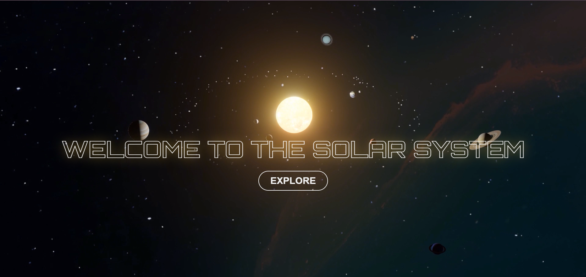

# 🌌 CosmoSphere – A Journey Through the Solar System

Welcome to **CosmoSphere**, an educational and visually engaging website that explores the wonders of the **solar system** and beyond. From the blazing core of the Sun to the icy edges of distant galaxies, this site aims to make space knowledge accessible, fun, and beautiful.

> ⚠️ **Note:** This project is currently on **standby**. Development is paused temporarily but will resume in the near future.

---

## Screenshots

### Homepage :


## 🚀 Features

- 🪐 Detailed sections on **Planets**, **Moons**, **Stars**, and **Galaxies**
- 🌞 Educational content about the **Sun** and **space missions**
- 📸 Rich visuals and responsive layout for an immersive experience
- 🎨 Clean UI design using **HTML & CSS**
- 🎯 Smooth user navigation and engaging structure

---

## 📂 Project Structure

```plaintext
CosmoSphere/
│
├── index.html # Main landing page
├── stylesheet/
│ └── style.css # All CSS styling
├── images/
│ └── home-page/ # All images used in the homepage
├── Pages/ # Individual topic pages (Planets, Moons, Stars, etc.)
│ ├── Planet.html
│ ├── Moons.html
│ ├── Stars.html
│ ├── Galaxy.html
│ └── space-missons.html
└── Js/
└── script.js # Custom JavaScript + ScrollReveal animations
```
---

## 💡 Technologies Used

- **HTML5** – Structure of the web pages
- **CSS3** – Styling and responsive layout
- **Font Awesome** – Icon library
- **ScrollReveal.js** – Simple scroll animation library

---

## 📌 Future Plans

- Add interactive elements for each section
- Improve responsiveness and accessibility
- Complete each pages
- Improve the UI

---

## ❤️ Acknowledgements

Made with passion and curiosity for the cosmos.

> “Somewhere, something incredible is waiting to be known.” – Carl Sagan

---
