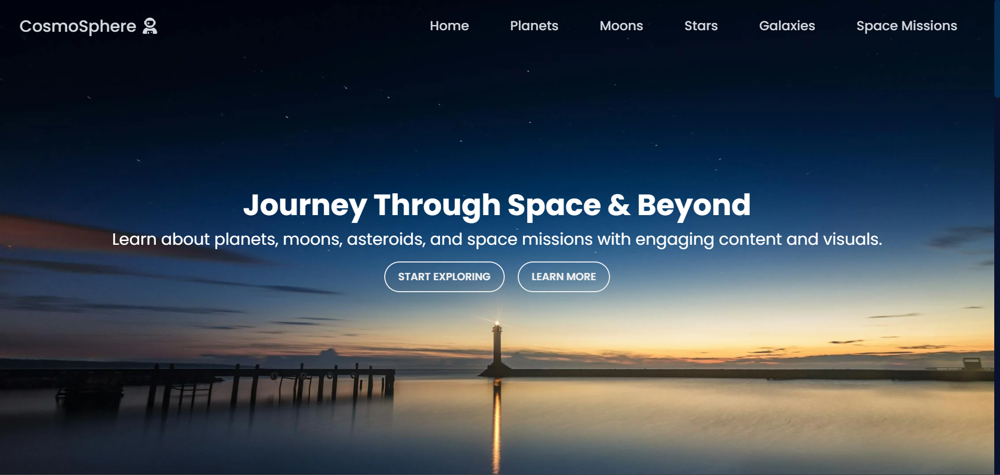

# Solar System Website

Welcome to the **Solar System Website** project! This project is designed to give users a visually immersive experience of exploring the solar system, complete with background videos, interactive buttons, and planet-specific pages.

## Screenshots

### Homepage :

## Project Overview

This website contains the following pages and features:

1. **Home Page**:
    - A background video of the solar system plays to create a captivating experience.
    - A welcome text introduces users to the site.
    - An **Explore** button that directs users to the planet selection page.

2. **Planet Page**:
    - Displays images of all the planets in the solar system.
    - Each planet image has a corresponding button.
    - When the button for a planet is clicked, the user is taken to a dedicated page for that planet.

3. **Planet-Specific Pages**:
    - Every planet has its own page, displaying detailed information, facts, and visuals about that planet.
    
## Technologies Used

- **HTML5**: For structuring the content of the website.
- **CSS3**: For styling the site and adding animations.
- **Background Video**: Used on the homepage for an engaging user experience.

## Features

- **Interactive UI**: Users can explore the solar system and learn about each planet by clicking on the respective buttons.
- **Individual Planet Pages**: Each planet has its own dedicated page with information and a unique design.
